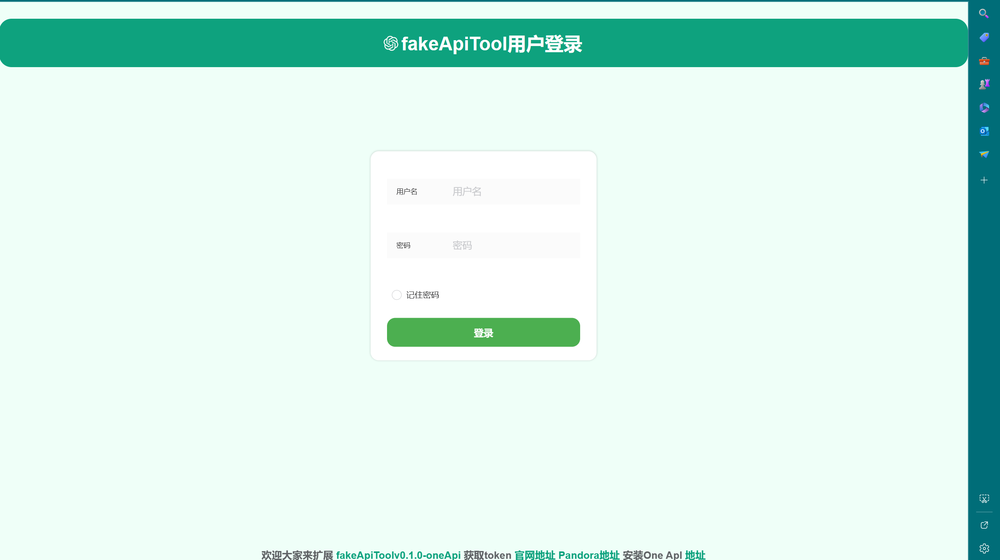
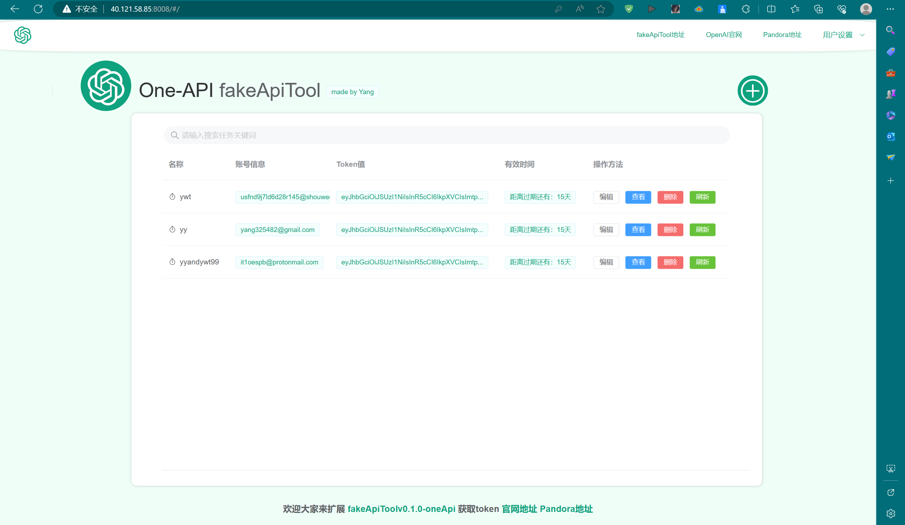

# FakeApiTool
##### 请给我点个免费的star⭐吧，十分感谢！
## 简介

FakeApiTool 是一个基于 [One API](https://github.com/songquanpeng/one-api) 和 [Pandora](https://ai.fakeopen.com/) 中的 [fakeApi](https://ai.fakeopen.com/) 的工具，旨在更加简便地使用[pandora](https://ai.fakeopen.com/)资源，使得可以方便地白嫖 chatGPT，本工具是站在巨人的肩膀上，方便大家，麻烦给个不要钱的星星⭐⭐⭐！

### 请大家要安装One-API并启动SQL在进行使用！
##### docker One-API启动命令（不要忘记用mysql创One-API数据表）
```
# 记得在下面代码的指定位置填写好你的One-API数据表的密码
docker run --network="host" --name one-api -d --restart always -p 3000:3000 -e SQL_DSN="oneapi:(填写你的One-API数据表的密码)@tcp(localhost:3306)/oneapi" -e TZ=Asia/Shanghai -v /home/ubuntu/data/one-api:/data justsong/one-api 
```

## 功能特性

1. **保存账号信息：** 支持保存 OpenAI 账号密码和 token，方便快速访问。

2. **自动获取 API keys：** 工具可以自动获取 One-API 的 API keys，省去手动获取的步骤。

3. **自动添加删除修改渠道：** 工具能够自动在 One-API 中添加删除修改渠道，简化配置过程。

4. **每日自动更新渠道请求地址：** 工具会每日自动更新渠道的请求地址，确保始终使用最新的数据。

### 初始用户名：root 初始密码值:123456

#### 请在初次使用后，把账号密码更改成One-API的账号密码

- 现如今只支持账号密码登录，希望大佬能扩充！

### 图片展示


## 管理Token,记录token更新时间，自动更新One-APi的渠道


## 手机端展示


## 使用方法
- 1.请确保部署好了One-API,且One-api接入了Sql,点击[详情](https://github.com/songquanpeng/one-api)
- 2.下载[启动包](https://github.com/Yanyutin753/fakeApiTool-One-API/blob/main/simplyDeploy/fakeApiTool-0.0.1-SNAPSHOT.jar)
- 3.上传到安装好One-API的服务器上
- 4.到达安装好包的路径下
```
# 填写下面路径
cd （你的安装路径）
```
- 5.输入下面代码启动（要先有python和java环境哦）
```
# 安装pandora-chatgpt插件
pip install pandora-chatgpt
# 先运行python代码（端口号为8082）
nohup python3 app.py
#开放端口号8082，用于后面的更新token
# 修改下面代码，输入你的oneapi数据库密码、你的One-API部署网址和你的刚刚python启动的IP地址
nohup java -jar fakeApiTool-0.0.1-SNAPSHOT.jar --server.port=8008 --spring.datasource.password=（你的oneapi数据库密码） --spring.datasource.username=oneapi --baseUrlWithoutPath=(http/https://你的One-API网址的ip+端口号) --baseUrlAutoToken=(http/https://你的Python网址的ip+端口号):8082 > output.log 2>&1 &
# 等待一会 放行8008端口即可运行
```

### 想要二开项目的友友们，可以自行更改前后端项目，本人小白，项目写的不太好，还请谅解！

## 强调
本项目是站在巨人的肩膀上的，感谢[One API](https://github.com/songquanpeng/one-api)大佬，感谢[Pandora](https://ai.fakeopen.com/)大佬!，欢迎各位来帮助修改本项目，使得本项目变得更方便，更简单！

### 请给我一个免费的⭐吧！！！
